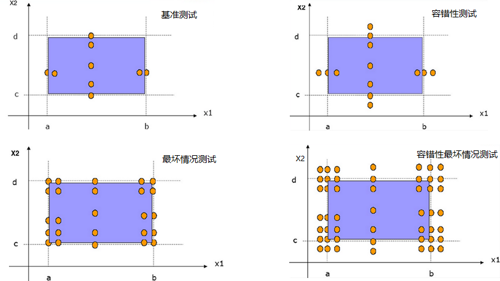
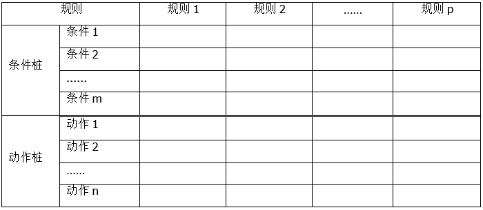
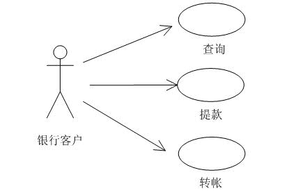

# 4 测试技术

**关键词**

黑盒测试技术(black-box test technique)， 边界值分析(boundary value analysis)，
基于检查表的测试(checklist-based testing)， 覆盖(coverage)， 判定覆盖(decision
coverage)， 决策表测试(decision table testing)， 错误推测(error guessing)，
等价类划分(equivalence partitioning)， 基于经验的测试技术(experience-based test
technique)， 探索性测试(exploratory testing)， 状态转换测试(state transition
testing)， 语句覆盖(statement coverage)， 测试技术(test technique)，
用例测试(use case testing)， 白盒测试技术(white box test technique)

**测试技术的学习目标**

**4.1测试技术的分类**

FL-4.1.1
(k2)解释黑盒测试技术、白盒测试技术和基于经验的测试技术之间的特征、共同点和区别

**4.2黑盒测试技术**

FL-4.2.1 (k3)应用等价分从给定的需求中导出测试用例

FL-4.2.2 (k3)应用边值分析从给定的需求中导出测试用例

FL-4.2.3 (k3)应用决策表测试从给定的需求中导出测试用例

FL-4.2.4 (k3)应用状态转换测试从给定的需求中导出测试用例

FL-4.2.5 (k2)解释如何从用例推导出测试用例

**4.3白盒测试技术**

FL-4.3.1 (k2)解释语句覆盖

FL-4.3.2 (k2)解释判定覆盖

FL-4.3.3 (k2)说明语句覆盖和判定覆盖的价值

**4.4基于经验的测试技术**

FL-4.4.1 (k2)解释错误推测

FL-4.4.2 (k2)解释探索性测试

FL-4.4.3 (k2)解释基于检查表的测试

## *4.1 测试技术分类*

### 4.1.1 测试技术分类和特性

本章主要讨论黑盒测试技术、白盒测试技术和基于经验的测试技术这三类。这三个类别和其中包含的具体测试技术如表4.1.1-1所示。

黑盒测试技术（又称行为或基于行为的技术）基于对适当的测试依据的分析（例如正式的需求文档、规格说明、用例、用户故事或业务流程），所以有些地方也把黑盒测试技术称为基于规格说明的技术。这些技术既适用于功能测试，也适用于非功能测试。黑盒测试技术关注在测试对象的输入和输出上，而不关注其内部结构。

白盒测试技术（又称结构或基于结构的技术）基于对测试对象的架构、详细设计、内部结构或代码的分析。与黑盒测试技术不同，白盒测试技术关注在测试对象的内部结构和处理。

基于经验的测试技术利用开发人员、测试人员和用户的经验来设计、实现和执行测试。这些技术通常与黑盒和白盒测试技术结合在一起。

表4.1.1-1 测试技术分类

| **测试技术分类**   | **测试技术**                                           |
| ------------------ | ------------------------------------------------------ |
| 黑盒测试技术       | 等价类划分 边界值分析 决策表测试 状态转换测试 用例测试 |
| 白盒测试技术       | 语句测试 判定测试                                      |
| 基于经验的测试技术 | 错误推测 探索性测试 基于检查表的测试                   |

黑盒测试技术的共同特点包括：

-   测试条件、测试用例和测试数据来自于以下测试依据：软件需求、规格说明、用例和用户故事等

-   测试用例可用来发现需求与需求实现之间的差距，以及与需求之间的偏离情况

-   覆盖率的度量基于测试依据中被测试的条目和应用于测试依据的技术

白盒测试技术的共同特点包括：

-   测试条件、测试用例和测试数据来自于以下测试依据：代码、软件架构、详细设计或任何其他有关软件结构的信息来源

-   覆盖率的度量基于选定结构（例如代码或接口）内被测试的条目

-   规格说明常常被用作额外的信息来源，以确定测试用例的预期结果

基于经验的测试技术的共同特点包括：

-   测试条件、测试用例和测试数据来自于以下测试依据：测试人员、开发人员、用户和其他利益相关者的知识和经验

上面的分析，可以说明黑盒、白盒和基于经验的测试技术在测试依据的来源上有本质的区别，从而导致它们对应的覆盖率相关的度量也是不同的。基于经验的测试技术由于和相关人员的经验有关，在可度量方面最弱。但是基于经验的技术可以和其他两种相结合，在进行基于经验的测试时，可以灵活的使用黑盒或者白盒技术。

### 4.1.2 选择测试技术

本章讲到的各种测试技术产生的历史都很悠久，都是非常基础的测试技术。很多读者看到这些技术会觉得非常熟悉，理解起来也很简单。但是在实际应用中，很多人都会发现这些技术都用不上，进而就觉得这些技术没有用。很多人再学习了一些测试技术后，很快又回到了他们没有学习之前的状态。

这些技术有用吗？答案是肯定的。在实际测试中，这些技术不好用。一方面是因为，很多人还没有能够灵活的掌握这些技术，不能做到活学活用；另外也需要认识到，没有一种技术是可以包治百病的，每种技术都有它适合的场景。

下面是一段关于银行借记卡转账的费用描述：

柜台、ATM：

跨行转账手续费：每笔0.2万元以下(含0.2万元)，收费2元;0.2万—0.5万元(含0.5万元)，收费5元;0.5万—1万元(含1万元)，收费10元;1万—5万元(含5万元)，收费15元;5万元以上，按转账汇款金额的0.03%收取，最高收费50元。

网上银行：

跨行转账手续费：每笔0.2万元以下(含0.2万元)，收费1元;0.2万—0.5万元(含0.5万元)，收费2.5元;0.5万—1万元(含1万元)，收费5元;1万—5万元(含5万元)，收费7.5元;5万元以上，按转账汇款金额的0.015%收取，最高收费25元。2014年8月1日-2015年6月30日，同城普通跨行转账每笔按1元收费。

上面的这段描述的费用说明，并不是特别复杂。在各种纷繁复杂的银行业务中，这个应该是比较容易测试的。拿到这段需求以后，测试人员如何测试用例呢？大家不妨拿出笔来自己亲手设计一下。这段简短的说明，要想测试的比较充分，显然需要用到后面讲到的等价类、边界值和决策表等方法。

一般应该根据如下各种不同的情况来具体选择不同的技术：

-   测试对象类型：不同的程序，它们的复杂度也截然不同。应该根据测试对象选择合适的测试技术。比如，程序中的判定是由多个原子条件组合而成的，那么分支覆盖测试是不充分的，应该选择合适的测试技术来检查程序中的条件，例如条件组合覆盖。具体选择哪种技术依赖于失效情况下的风险。

-   文档和工具的可用性：如果有详细的规格说明或者模型信息，这些就可以直接作为测试设计的输入，从而得到具体的测试用例。这样就可以极大地减少测试设计的工作量。

-   符合标准的要求
    ：行业标准和法律法规会要求使用特定的测试技术和覆盖准则，特别是安全关键系统或者高完整性级别的软件。

-   测试人员的经验：
    具有不同经验的测试人员会选择不同的测试技术。例如，测试人员会倾向使用以前找到过严重失效的技术。

-   客户的期望：客户可能会要求采用特殊的测试技术和达到一定的测试覆盖率（当使用白盒测试设计技术的时候）。这是种比较好的做法，因为它一般能降低测试工作量，保证在客户或验收测试时，残留更少的缺陷。

-   风险分析：通过风险分析来指导测试工作，即选择具体测试技术和确定测试执行的强度。对于高风险的区域应该进行更彻底的测试。

-   其他因素：比如规格说明和其他文档的可用性，测试人员的知识、技能和个性，时间和预算的限制，测试级别和以前的经验，如哪些缺陷发生的比较频繁，通过什么测试技术发现了这些缺陷等。这些都会很大程度地影响测试技术的选择。

## *4.2黑盒测试技术*

### 4.2.1 等价类划分

等价类划分是把所有可能的输入数据，即程序的输入域划分成若干部分（子集），然后从每一个子集中选取少数具有代表性的数据作为测试用例。该方法是一种重要的，常用的黑盒测试用例设计方法。

等价类是指某个输入域的子集合。在该子集合中，各个输入数据对于揭露程序中的错误都是等效的，并合理地假定：测试某等价类的代表值就等效于对这一类中其它值的测试。因此，可以把全部输入数据合理划分为若干等价类，在每一个等价类中取一个数据作为测试的输入条件，就可以用少量代表性的测试数据取得较好的测试结果。等价类通常包括有效等价类和无效等价类：

-   有效等价类：是指对于程序的规格说明来说是合理的，有意义的输入数据构成的集合。利用有效等价类可检验程序是否实现了规格说明中所规定的功能和非功能特性。

-   无效等价类：与有效等价类的定义恰巧相反，该等价类中包括的是程序认为无效的数据。

设计测试用例时，要同时考虑这两种等价类。因为软件不仅要能接收合理的数据，也要能经受意外的考验。这样的测试才能确保软件具有更高的可靠性。

**1.划分等价类的方法**

下面给出六条确定等价类的原则：

-   在输入条件规定了取值范围或值的个数的情况下，则可以确立一个有效等价类和两个无效等价类。例如：网站上某商品的库存范围为1到99，那么针对商品库存的有效等价类是1到99，两个无效等价类分别是小于1和大于99。

-   在输入条件是一个布尔量的情况下，可确定一个有效等价类和一个无效等价类。
    有效等价类是真和假，其他所有输入构成了无效等价类。

-   在规定了输入数据的一组值（假定n个），并且程序要对每一个输入值分别处理的情况下，可确立n个有效等价类和一个无效等价类。例如：公园门票针对老人、成年人和小孩分别有不同的票价，那么就可以生成3个有效等价类（老人、成年人和小孩），以及一个无效等价类（不属于上述三类人）

-   在规定了输入数据必须遵守的规则的情况下，可确立一个有效等价类（符合规则）和若干个无效等价类（从不同角度违反规则）。例如：某公司规定服务年限大于五年的女性员工在妇女节那天可以放假一天，那么有效等价类显然就是同时满足服务年限大于5年并且是女性的员工，而无效等价类有两个，一个是服务年限没有超过5年，另外一个是女性员工。

在确知已划分的等价类中各元素在程序处理中的方式不同的情况下，则应再将该等价类进一步的划分为更小的等价类。

**2.设计测试用例**

在确立了等价类后，可建立等价类表，列出所有划分出的等价类。初始的表格如表4.2.1-1所示。

>   表4.2.1-1 等价类初始表格

| 输入条件 | 有效等价类 | 无效等价类 |
| -------- | ---------- | ---------- |
|          |            |            |
|          |            |            |

例如：为了覆盖所有的有效等价类和无效等价类，可以从划分出的等价类中按以下三个原则设计测试用例：

①为每一个等价类规定一个唯一的编号。

②设计一个新的测试用例，使其尽可能多地覆盖尚未被覆盖地有效等价类，重复这一步。直到所有的有效等价类都被覆盖为止.。

③设计一个新的测试用例，使其仅覆盖一个尚未被覆盖的无效等价类，重复这一步。直到所有的无效等价类都被覆盖为止。

**3.等价类案例**

某商店为购买不同数量商品的顾客报出不同的价格，其报价规则如表4.2.1-2所示。

表4.2.1-2 等价类案例描述

| **购买数量**                | **单价（单位：元）** |
| --------------------------- | -------------------- |
| 前5件（第1件到第5件）       | 20                   |
| 第二个5件（第6件到第10件）  | 18                   |
| 第三个5件（第11件到第15件） | 15                   |
| 超过15件                    | 12                   |

如买8件需要支付5\*20+3\*18=154元，买20件需要支付5\*20+5\*18+5\*15+5\*12=325元。现在该商家开发一个软件，输入为商品数C（1≤C≤50），输出为应付价钱P。采用等价类划分法为该软件设计测试用例（不考虑C为非整数的情况）。

表4.2.1-3 利用等价类获得的输入数据

| 序号 | 输入C                              | 输出P |
| ---- | ---------------------------------- | ----- |
| 1    | 0（任意小于1的数）                 | N/A   |
| 2    | 80（任意大于50的数）               | N/A   |
| 3    | 3（任意大于等于1小于等于5的数）    | 60    |
| 4    | 8（任意大于等于6小于等于10的数）   | 154   |
| 5    | 12（任意大于等于11小于等于15的数） | 220   |
| 6    | 18（任意大于等于16小于等于50的数） | 301   |

等价类划分法是把程序的输入域按规则划分为若干子集，然后从每个子集中选取一具有代表性的数据作为测试用例。上例规定了C的取值范围（1
≤C≤50)，按规则可以划分为一个有效等价类{C\|1 ≤C ≤50}和两个无效等价类{C\|C\<
1}、{C\|C\>
50}。表中对C取不同值有不同的处理，因此上述有效等价类还可以进一步细分为4个等价类{C\|1
≤C ≤5}、{C\| 6 ≤C ≤10}、{C\|11 ≤C ≤15}、{C\|16 ≤C
≤50}。这样一共得到6个等价类，包括4个有效等价类{C\|1 ≤C ≤5}、{C\| 6 ≤C
≤10}、{C\|11 ≤C ≤15}、{C\|16 ≤C
≤50}和两个无效等价类{C\|C\<1}、{C\|C\>50}。设计用例时从这6个等价类中任选一个代表数据即可。

### 4.2.2 边界值分析

边界值分析（Boundary Value
Analysis）方法的理论基础，是假定大多数的错误是发生在各种输入条件的边界上，如果在边界附近的取值不会导致程序出错，那么其它的取值导致程序错误的可能性也很小。

当测试对象的输入条件明确了一个值的取值范围，规定了值的个数，或者明确了一个有序集合，我们就可以使用边界值分析方法。

边界值是一种非常重要的测试技术，它有如下的特点：

-   价值：边界值分析技术可以显著的减少测试用例数量。边界值上是最容易发现缺陷的地方；边界值分析技术应该和等价类划分技术紧密结合使用。

-   局限/困难：精确性取决于等价类划分的精确性，它的局限和困难与等价类相仿。必须注意有效数据和无效数据的增幅以便于精确地定义测试数据。只有有序的等价类可以做边界值分析，但这并不妨碍对某个范围内有效输入的分析。例如，测试电子表格支持的单元格数量，一个包含可以允许的最大单元格数量（边界）的等价类，而另一个等价类则从超过这个边界1
    个单元格（超过边界）开始 。

-   覆盖率：等于测试的边界条件总数除以识别的边界条件总数（二值测试法或三值测试法）。这就提供了边界测试的覆盖百分率。

边界值分析总能发现边界的位移或遗漏，也可能会发现额外的边界情况。这种技术可用于发现处理边界值，尤其是小于和大于逻辑错误（即位移）的缺陷。它也可以用来寻找非功能性缺陷，例如负载限制的容差（如，系统支持10,000个并发用户）。

有两种边界值分析法：二值测试法、三值测试法。二值测试法，就是在边界上取两个值，分别在不同的等价类里面。例如，如果等价类的值域是1到10，步长是0.5，上界的边界值为10和10.5，下界的边界值为1和0.5。三值测试法，就是找到边界，边界值加上最小步长，以及边界值减去最小步长。在上面的例子中，上界为
9.5、10和10.5，下界为：1.5、1 和
0.5。采用二值测试法还是三值测试法取决于被测项的风险大小。风险高的采用三值测试法。

**1.设计原则：**

-   如果输入条件规定了值的范围，按照二值法，则应取刚达到这个范围的边界的值，以及刚刚超越这个范围边界的值作为测试输入数据。例如：如果软件的规格说明中规定：“重量在10公斤至50公斤范围内的邮件，其邮费计算公式为……，重量精确到小数点后2位”。设计基于边界值的测试用例，如果采用二值法，我们应取10、50，还应取9.99及50.01等。

-   如果输入条件规定了值的个数，在二值法的情况，则用最大个数,最小个数,比最小个数少1，比最大个数多1的数作为测试数据。例如：一个输入文件可存储1\~255个记录。测试用例可取1和255，还应取0及256等。

-   尽量选择非常庞大的数据结构、列表和表格等作为边界值分析的数据。例如：那些能使内存溢出、文件和数据存储到达边界的数据，来检查测试对象在这种极端情形下的行为。

-   对于列表和表格，空列表和满列表以及列表的第一个元素和最后一个元素都是应该作为分析的对象，因为测试它们常常可以发现由于编程错误而导致的失效。

**2.设计步骤**

边界值分析使用与等价类划分法相同的划分，只是边界值分析假定错误更多地存在于划分的边界上，因此在等价类的边界上以及两侧的情况设计测试用例。

-   将软件的输入或者输出参数进行等价类划分

-   在等价类的基础之上进行边界值分析。一般情况下，假如边界值已经由等价类划分覆盖，则可以不予考虑

-   将边界值进行组合，作为测试用例的输入数据

**3.渐进健壮**

在利用边界值分析技术的时候，大部分情况面对的都是两个或两个以上的变量。那么情况比只有单个变量要复杂。同时，在进行了基本的边界值分析的基础上，可以根据情况适当增加更多的测试。图4.2.2-1展示的是两个变量X1,X2。它们的有效取值区间分别为[a,b]，[c,d]。除了基准测试之外，还可以进行其他各种更进一步的测试。

图4.2.2-2 边界值分析的渐进健壮

**对于有n个输入变量的程序，基准测试边界值分析的测试用例个数为4n+1。**

前面讲到的边界值测试分析采用了可靠性理论的单缺陷假设。

-   优点：简便易行；生成测试数据的成本很低

-   局限性：测试用例不充分；不能发现测试变量之间的依赖关系；不考虑含义和性质；

-   结论：只能作为初步测试用例使用

容错性/健壮性是指在异常情况下，软件还能正常运行的能力。健壮性考虑的主要部分是预期输出，而不是输入。健壮性测试是边界值分析的一种简单扩展。除了变量的5
个边界分析取值还要考虑略超过最大值（max）和略小于最小值（min）时的情况。健壮性测试的最大价值在于观察处理异常情况，它是检测软件系统容错性的重要手段。如图4.2.2-1所示。

**对于有n个输入变量的程序，健壮性测试的测试用例个数为6n+1。**

**对于有n个输入变量的程序，最坏情况测试的测试用例个数为5\^n。**

**对于有n个输入变量的程序，健壮最坏情况测试的测试用例个数为7\^n。**

**4.次边界**

对系统越了解，你就越能发现系统的边界；对相关的背景知识越了解，你就能越能发现系统的“次边界”。次边界是由具体实现产生的，例如，计算机本身的限制，数据存储的限制，协议的限制，操作系统的限制等。例如，在32位操作系统中，整形的最大值65536，支持的内存最大4GB；电话线传输速率小于光纤传输速率等。

### 4.2.3 决策表测试

决策表可以方便的获取特定的系统需求和记录测试对象的内部实现，可以用来记录测试对象的各种复杂规则，同时它可以有效的指导测试用例的设计。尽管决策表测试对于测试人员而言非常重要，但是许多测试人员并不熟悉这种技术。

决策表是分析和表达多逻辑条件下执行不同操作的表格。决策表能够将复杂的问题按照各种可能的情况全部列举出来，以避免测试需求的遗漏。因此，利用决策表可以设计出比较完整的测试用例集合。决策表测试技术特别适用于下面的使用场景：针对不同的逻辑条件的组合，测试对象需要执行不同的操作。

决策表有四个部分组成，分别是条件桩（Condition Stub）、动作桩（Action
Stub）、条件项（Condition Entry）和动作项（Action
Entry），具体格式如表4.2.3-1所示。决策表四个组成部分的含义如下：

-   条件桩：列出了测试对象的所有条件。一般情况下，列出的条件的次序不会影响测试对象的动作。

-   动作桩：列出了测试对象所有可能执行的操作。一般情况下，这些执行的操作没有先后顺序的约束。

-   条件项：列出针对特定条件的取值，即条件的真假值。

-   动作项：列出在不同条件项的各种取值组合情况下，测试对象应该执行的动作。

UDO W. POOCH,Translation of Decision Tables,Computing Surveys, Vol. 6, No. 2,
June 1974

表4.2.3-1 决策表模板

使用决策表进行测试的步骤为：

（1）列出所有的条件桩和动作桩

（2）填入条件项

（3）填入动作项，制定初始判定表

（4）简化、合并相似规则或者相同动作

下面通过具体的案例分析，阐述决策表测试的基本概念和步骤。

**三角形类型的判断**

测试对象从输入对话框中读取三个整数值a、b和c，这三个整数值代表了三角形三条边的长度。测试对象根据输入的三个整数显示提示信息，指出这样的三条边构成的是不规则三角形、等腰三角形、等边三角形还是非三角形。要求测试人员针对该场景，应用决策表测试技术设计相应的测试用例。

该三角形的例子生成的决策表如表4.2.3-2所示。

表4.2.3-2 三角形完整决策表

首先我们看规则9到规则16，这8条决策表是可以合并成一条的。就是当C1为N的时候，不管其他条件是什么，得到的都是A1：非三角形。

这样决策表经过上面这个8合一的优化后就变成9条规则了。

这个里面还需要去掉规则2、规则3和规则5这三条不符合逻辑的，因为这三条规则不符合逻辑，无法根据这些规则生成测试用例，所以去处。

这样经过8合一并去掉三个不符合逻辑的规则后，优化后的决策表就只有6条了。优化后的决策表如表4.2.3-3所示。

表4.2.3-3 三角形优化后的决策表

### 4.2.4 状态转换测试

很多情况下，测试对象的输出和行为方式不仅受当前输入数据的影响，同时还与测试对象之前的执行情况，或者之前的事件以及之前的输入数据有关。为了说明测试对象和历史数据之间关系，引入了状态图。状态图是进行状态转换测试设计的基础。

状态转换测试方法，是一种黑盒测试技术。其应用模式是被测组件拥有多个状态，各个状态之间的转换由事件来触发，各个状态之间的转换还可能导致一些动作的产生。在面向对象系统的测试尤其有用，因为在面向对象系统中，对象可以有不同的状态，操作对象的方法必须能根据不同的状态做出相应的反应。同时这种测试技术也常常用于嵌入式软件行业中。

>   **1、状态转换图的组成**

-   状态：以圆圈表示，开始和结束是特殊状态；

-   转换：由于事件的驱动，系统从一个状态到另一个状态；

-   事件：以系统的相关接口触发，和特定的转换关联；

-   活动：活动由状态转换触发；

-   条件：说明状态转换只有在满足这个条件后进行。

>   **2、适用场景**

-   涉及多种状态，最好是针对一个对象的多个状态。否则把多个对象的多个状态都放在一个模型中，容易引起混淆；

-   各种状态间可以由于某种事件的发生相互转换；

-   用于测试有定义的状态和引起状态转换的事件（比如变化的屏幕）的软件。嵌入式软件，web软件和任何类型的状态转换软件都是这类测试技术的理想候选对象。控制系统，比如交通信号控制系统，也是这类测试的理想对象；

-   可以用于任一测试级别。

>   **3、覆盖策略**

状态转换测试中的覆盖率还会涉及到“N-Swtich”的概念（中文通常翻译成“N-切换”）。状态转换测试的覆盖率可以是1-Switch、2-Switch，可以一直深入取更大的N以达到更好的覆盖率，当然测试的工作量也会更大。N-Swtich是由TSUN
S.
CHOW在1978年提出的，他将N-Switch定义为程序图中长度为n+1的连续的边或弧线（通常在状态图中表示循环）的序列。所以单独的一条边（或者转换）就是一个0-Switch，两条连续的边的序列就是1-Switch。

下面以图 4.2.1-1所示的状态机分别说明0-Switch和1-Switch的概念和区别。

图 4.2.4-1 状态机示例图

如图4.2.4-1所示的状态机示例，其中圆圈表示状态，带箭头的边表示转换，同时为每个转换定义了一个英文字母的标识。根据0-Switch的定义，该状态机对应的所有的0-Switch为：a、b、c、d、e、f。再来看一下1-Switch。根据1-Switch的定义，该状态机对应的所有1-Switch为：ab、ac、bb、bc、cd、ce、dd、de、ea、ef、fd、fe。

TSUN S. CHOW, Testing Software Design Modeled by Finite-State Machines, Software
Engineering, IEEE Transactions on Volume: SE-4 , Issue: 3, 1978.

使用状态转换测试时，可以根据项目情况选择合适的覆盖，例如：

-   覆盖每个状态和每一个转换。100％的转换覆盖（又称100％的0-切换覆盖或100％的逻辑分支覆盖）将保证访问了每个状态和遍历每个状态转换，除非系统设计或状态转换模型（图或表）有缺陷。根据状态和转换之间的关系，它可能需要不止一次穿越一些转换以执行一次其他转换。

-   “N-切换覆盖”指覆盖状态转换的数目。比如：100%的1-切换覆盖要求每个由两次成功转换组成的有效序列至少被测试了一次。这样的测试可以发现100%的0-切换覆盖遗漏的失效。

-   “往返覆盖”在转换序列形成循环的情况下适用。实现100％往返覆盖意味着从任何状态出发又回到原来相同状态的所有循环被测试到。这必须测试循环中包含的所有状态。

-   尝试包括所有无效的转换可以达到一个更高的覆盖率。覆盖要求和状态转换测试的覆盖集必须确定是否包括无效的转换。

如果测试对象有很多状态和状态转换，这就需要更多的测试工作量，在可能的情况下应该寻找对策来简化测试对象。

>   **4、应用步骤**

>   1）绘制状态转换图

>   2）使用“N-SWITCH”覆盖方式生成用例

>   3）扩展用例

>   **5、举例：**QQ通讯工具的状态切换：在线，忙碌，离开，隐身，离线

>   1）将各状态之间事件画出来。完成的状态转换图如图4.2.4-1所示。

图4.2.4-1 QQ状态转换图

>   2）列出穿越0个状态的测试用例（状态自身的）

>   根据图4.2.4-1中的状态转换图，可以生成如表4.2.4-1所示的状态转换表。

表4.2.4-1 QQ状态转换表

| **编号** | **前提** | **事件**                 | **结果** |
| -------- | -------- | ------------------------ | -------- |
| 1        | 忙碌     | 手工切换忙碌             | 忙碌     |
| 2        | 忙碌     | 断网或手工切换离线       | 离线     |
| 3        | 忙碌     | 非工作时间手工切换离开   | 离开     |
| 4        | 忙碌     | 手工切换在线             | 在线     |
| 5        | 忙碌     | 手工切换隐身             | 隐身     |
| 6        | 隐身     | 非工作时间手工切换忙碌   | 忙碌     |
| 7        | 隐身     | 手工切换在线             | 在线     |
| 8        | 隐身     | 断网或手工切换离线       | 离线     |
| 9        | 隐身     | 手工切换隐身             | 隐身     |
| 10       | 在线     | 手工切换在线             | 在线     |
| 11       | 在线     | 非工作时间手工切换忙碌   | 忙碌     |
| 12       | 在线     | X分钟不操作电脑          | 离开     |
| 13       | 在线     | 手工切换离线             | 离线     |
| 14       | 在线     | 手工切换隐身             | 隐身     |
| 15       | 离开     | 手工切换离开             | 离开     |
| 16       | 离开     | 手工切换在线或操作电脑   | 在线     |
| 17       | 离开     | 非工作时间，手工切换忙碌 | 忙碌     |
| 18       | 离开     | 断网或手工切换           | 离线     |
| 19       | 离线     | 登录                     | 在线     |

>   3）列出穿越1个状态的（一个状态，两个事件）

这里的穿越1个状态指的是从状态A开始，经过状态B，到达状态C。由于这个里面涉及到了从状态A到状态B，又涉及到了从状态B到状态C。这样的情况也可以称为“1
Switch”（也称为“1切换”）。（这部分内容在ISTQB高级测试分析师中有更详细的描述）

表4.2.4-2 QQ状态1 Switch测试（部分用例）

| **编号** | **前提** | **测试用例描述**                                             | **预期结果** |
| -------- | -------- | ------------------------------------------------------------ | ------------ |
| 1        | 忙碌     | 处于忙碌状态下，处于非工作时间手工切换离开，到达**离开**状态，再通过非工作时间手工切换**忙碌** | 忙碌         |
| 2        | 忙碌     | 处于忙碌状态下，处于非工作时间手工切换离开，到达**离开**状态，手工切换在线或操作电脑，到**在线**状态 | 在线         |
| 3        | 忙碌     | 处于忙碌状态下，处于非工作时间手工切换离开，到达**离开**状态，断网或手动切换至离线状态 | 离线         |
| 4        | 在线     | 处于在线状态下，X分钟不操作电脑，到达**离开**状态，断网或手动切换至**离线**状态 | 离线         |
| 5        | 在线     | 处于在线状态下，X分钟不操作电脑，到达**离开**状态，手工切换**在线**或操作电脑 | 在线         |
| 6        | 在线     | 处于在线状态，X分钟不操作电脑，到达**离开**状态，通过非工作时间手工切换**忙碌** | 忙碌         |

>   **6、局限/困难：**

定义状态表或状态图时确定状态往往是最困难的部分。当软件有一个用户界面，为用户显示的各种画面经常被用来定义状态。嵌入式软件，状态可能会依赖于硬件所处的状态。

>   **7、注意事项**

-   开始写规格说明的时候，就从测试的角度来评估测试对象的状态转换图

    -   假如测试对象有很多状态和状态转换，表明需要更多的测试工作量，可能的情况下应该寻找对策简化测试对象

-   检查规格说明，确保测试对象状态容易识别，且这些状态不是由大量不同变量组合构成的；保证从外部可以比较容易地访问状态变量。

-   在测试过程中如能使用设置状态/重设状态函数以及读取状态值函数等将会给测试带来很大益处。

-   定义状态需要考虑的信息

    -   状态转换之前的状态

    -   触发状态转换的触发事件

    -   在状态转换时触发的期望反应

    -   接下来的期望状态

>   **8、总结：**

-   状态是一个抽象的概念

-   状态是由事件触发一个转换

-   前一个状态或当前条件影响下一个状态

-   如果一个事件，触发来自相同状态的两个或多个不同的转换，会有一个守护条件作限制

-   状态图中只显示有效的转换，会排除无效的转换

-   测试用例要覆盖一个典型的状态序列，包含有效的或无效的

### 4.2.5 用例测试

说到用例测试，那么首先要了解用例以及基于用例的开发。随着面向对象软件开发方法应用的增多，统一建模语言UML的使用越来越频繁（UML定义了可以在软件开发过程中使用的10多种图形符号）。其中用例是UML规范中标准化的需求表述体系，用例方法最早是由Iva
Jackboson博士提出的。

Pan-Wei Ng， Ivar Jacobson，December 2004，Aspect-Oriented Software Development
with Use Cases

用例是描述系统需求的一种方法，使用用例的方法来描述系统需求的过程就是用例建模。用例方法可以解决传统的需求描述方式（例如：需求规格说明）的一些缺点，例如：传统的需求规格说明非常容易混淆需求和设计的界限，导致不知道系统需求应该详细到何种程度；另一个缺点是需求分割了各个系统功能的应用环境，使人很难了解到这些功能是如何相互关联来实现一个完整的系统服务。

从用户的角度来看，他们并不想了解系统的内部结构和具体设计，用户更关心的是系统所能够提供的服务，也就是被开发出来的系统将是如何使用的，这就是用例方法的核心思想。用例模型主要由以下模型元素组成：

-   参与者（Actor）：存在于被定义系统外部，并与该系统发生交互的人或者其他系统，他们代表的是系统的使用者或者使用环境。

-   用例（Use
    Case）：用于表示系统所提供的服务，它定义了系统是如何被参与者所使用的，它描述的是参与者为了使用系统所提供的某个功能而与系统之间发生的一段“对话”。

-   通讯关联（Communication
    Association）：用于表示参与者和用例之间的对应关系，它表示参与者使用了系统中的哪些服务（用例），或者说系统所提供的服务（用例）是被哪些参与者所使用。

这三种元素在UML中的表述如图4.2.5-1所示。

图4.2.5-1 UML基本元素

以银行的自动取款机ATM为例，它的主要功能可以由图4.2.5-2来表示。ATM的主要使用者是银行客户，银行客户主要使用ATM进行银行账号的查询、提款和转账交易等。

图4.2.5-2 ATM用例图

用例包括其基本行为的可能变化，同时也可以包括异常行为和错误处理（系统对编程、应用和通信错误的响应和恢复，例如：触发错误消息）。测试可以从用例中推导出来。设计的测试是为了验证已定义的行为（基本的、异常的或替代的，以及错误处理）。基于用例的测试在测试典型的用户系统相互作用方面非常有用。

## *4.3白盒测试技术*

白盒测试技术是根据被测对象的结构系统化设计测试用例的一种方法，关注软件产品的内部细节和逻辑结构。如代码的结构（控制流图），数据的结构，菜单的结构，模块间相互调用的结构，业务流程的结构等。它把测试对象看作一个打开的盒子，盒子对应的是被测试的程序，测试人员通过全面了解程序内部逻辑结构，设计或选择测试用例，对所有逻辑路径进行测试，通过在不同点检查程序的状态，确定实际的状态是否与预期的状态一致。

（from：软件测试方法和技术 第3版 朱少民）

4.3.1 语句测试和覆盖

语句测试使用代码中的可执行语句。覆盖率以测试执行的语句数除以测试对象中可执行语句的总数来衡量，通常以百分比表示。

**1.语句覆盖**

选择足够多的测试数据，使被测程序中每个语句至少执行一次。

在保证每条语句都运行的前提下，测试用例应尽量少。

**2.源程序**

PRCEDURE  EXAMPLE(A，B:REAL; VAR X:REAL);

    READ
    
    BEGIN
    
    IF  (A\>1)  AND  (B=0)
    
          THEN    X:=X/A;
    
    IF  (A=2)   OR  (X\>1)
    
          THEN    X:=X+1;
    
    END;

**3.流程图**

针对上面的源代码可以生成如图4.3.1-1所示的控制流程图。

图4.3.1-1 控制流程图

**4.语句覆盖的测试用例**

表4.3.1-1是语句测试的测试用例。执行表中的测试用例，可以达到100%的语句覆盖。

表4.3.1-1 语句的测试用例

| 测试用例序号 （项目编号-项目版本号-模块号-测试用例编号） | 测试数据      | 说明                 | 覆盖路径 |
| -------------------------------------------------------- | ------------- | -------------------- | -------- |
| XX-V1-101-001                                            | A=2，B=0，x=4 | 两个判定表达式都取真 | sacbed   |

### 4.3.2 判定测试与覆盖

判定测试使用代码中的判定，并测试基于判定结果执行的代码。测试用例遵循从判定点出发的控制流(例如：对于IF语句，一个用于真的结果，一个用于假的结果；对于一个CASE语句，所有可能的结果都需要测试用例，包括默认结果）。

覆盖率通过测试执行的判定结果的数量除以测试对象中判定结果的总数来测量，通常以百分比表示。

**1.判定覆盖**

不仅每个语句必须至少执行一次，而且每个判定的每种可能的结果都应该至少执行一次，也就是每个判定的每个分支都至少执行一次。

**2.源程序**

PRCEDURE  EXAMPLE(A，B:REAL; VAR X:REAL);

    READ
    
    BEGIN
    
    IF  (A\>1)  AND  (B=0)
    
          THEN    X:=X/A;
    
    IF  (A=2)   OR  (X\>1)
    
          THEN    X:=X+1;
    
    END;

**3.流程图**

**4.判定覆盖的测试用例**

表4.3.1-2是判定覆盖的测试用例。执行表中的测试用例，可以达到100%的判定覆盖。当然满足100%判定覆盖的测试用例集合不是唯一的。

表4.3.1-2 判定覆盖的测试用例

| 测试用例序号  | 测试数据      | 说明                           | 覆盖路径 |
| ------------- | ------------- | ------------------------------ | -------- |
| XX-V1-101-001 | A=3，B=0，X=3 | 第一个判定表达式为真第二个为假 | sacbd    |
| XX-V1-101-002 | A=2，B=1，X=1 | 第一个判定表达式为假第二个为真 | sabed    |

### 4.3.3 语句与判定测试的价值

当实现100%的语句覆盖时，它确保代码中的所有可执行语句至少已测试过一次，但无法保证所有判定逻辑都已测试过。

当达到100%的判定覆盖率时，便会执行所有的判定结果，包括测试真的结果和假的结果，即使没有明确的假的语句（例如：没有ELSE的IF语句）。语句覆盖有助于发现代码中其他测试没有执行到的缺陷（如：有助于发现不可达代码）。判定覆盖有助于发现代码中的缺陷，在这些缺陷中，其他测试没有同时覆盖判定为真和假的情况。

达到100%的判定覆盖可以保证达到100%的语句覆盖（反之则不然）。

当然除了语句和判定覆盖之外，还有其他很多覆盖，在高级大纲中会覆盖。例如：条件覆盖。针对判定IF 
(A\>1)  AND 
(B=0)，虽然执行了表4.3.1-2中得测试用例，可以测试到该判定分别取真和假的情况，但是我们是否发现里面还有一些情况没有覆盖，那就是
(A\>1) 以及 (B=0）这两个条件的真和假是否都覆盖了呢？显然没有。

## *4.4基于经验的测试技术*

基于经验的测试技术，顾名思义，就是凭借测试人员的直觉和经验设计测试用例的一种测试技术。测试人员在采用基于经验的测试技术设计测试用例时，带有一定的随机性，应用以往在类似应用或领域的知识，自由发挥、放开思路、灵活的设计测试用例。运用基于经验的测试技术，能够发现运用系统化的测试方法不能发现的问题，此技术实现的覆盖率和有效性也截然不同。基于经验的测试技术，往往难以评估覆盖率，也很难度量。在测试依据文档，如需求规格说明书不全、模糊，甚至没有任何需求文档的情况下，基于经验的测试将是一种比较适合的测试策略。

下面将分别介绍3种常用的基于经验的测试技术。

### 4.4.1 错误推测

错误推测法是测试人员在测试时，根据经验或直觉推测程序中可能存在的各种错误，从而有针对性地编写检查这些错误的测试用例的方法。错误推测法的基本思想是，列举出程序中所有可能存在的错误和容易发生错误的特殊情况，根据它们选择设计测试用例。例如，在单元测试时曾列出的许多在模块中常见的错误，以前产品测试中曾经发现的错误等，
这些就是经验的总结。

基于测试人员的知识和经验，利用错误推测法来预测错误、缺陷和失效发生的技术，包括：

-   应用程序在过去是如何运作的；

-   开发人员倾向于犯什么样的错误；

-   其他应用程序中已经发生的失效。

错误推测法的一种系统化方法是创建一个可能的错误、缺陷和失效列表，设计测试以发现失效以及导致失效的缺陷。这些错误、缺陷和失效列表的构建可以是基于经验、缺陷和失效数据，也可以建立在对软件失败原因的常识基础上。

利用错误推测法设计测试用例的常见工作依据有：

-   在单元测试时陈列出的许多在模块中常见的错误；

-   以前测试过程中曾经发现的错误；

-   已发现缺陷的测试方法的推广；

-   容易发生错误的情况，如：输入或输出为0的情况，输入为空格或输入表格只有一行，共享参数同时使用在几个模块中等；

-   补充等价类和边界值法遗漏的一些等价类组合；

-   一些位置使用了共享变量，设计测试用例，修改一个共享变量，看其他位置有没有同时做修改。

### 4.4.2 探索性测试

探索性测试是基于经验测试技术的一种类型，更强调测试人员的个人自由、主观能动性和职责，抛弃繁杂的测试计划和测试用例设计过程，强调在碰到问题时及时改变测试策略。探索性测试在测试执行期间动态的设计、执行、记录和评估非正式的测试结果，并将设计、执行和结果分析作为并行且相互支持的测试活动。对探索性测试更加直白的定义就是：同时设计测试和执行测试。探索性测试强调测试设计和测试执行的同时性，测试人员通过测试来不断学习被测系统，并把学习到的关于软件系统的更多信息通过综合的整理和分析，创造出更多的关于测试的主意。这个过程可以用图4.4.2-1来形象的描述。

图4.4.2-1 探索性测试的过程

探索性测试分为自由式探索性测试、基于场景的探索性测试、基于策略的探索性测试和基于反馈的探索性测试，有时也会使用基于会话的测试来构建测试活动。在基于会话的测试中，探索性测试是在规定的时间内进行的，测试人员使用包含测试目标的测试章程来指导测试。测试人员可使用测试会话表记录所采取的步骤和发现。探索性测试的测试结果一般不容易度量，更多的是为了了解组件或系统，并为可能需要更多测试的区域创建测试。

Kaner, Cem; Bach, James; Pettichord, Bret (2001). Lessons Learned in Software
Testing. John Wiley & Sons

探索性测试一般适用于以下场景：

-   当测试人员是新手，可以一边训练一边测试

-   需要快速的对被测对象进行评估

-   在传统的测试脚本中发现新的问题需要快速验证

-   当有需要去确认另一位测试人员的工作状况

-   当团队内有熟悉相关领域知识的测试人员

-   当需要做冒烟测试

-   当被测对象设计完成后没有预先规划并准备好测试脚本

-   当项目采用敏捷软件开发过程

-   被测对象很复杂并且难以理解

-   当想要针对某个软件缺陷进行深入调查

-   当想要扩大脚本测试的多样性时 

-   当被测对象的规格说明很少或不充分的时候

-   当测试时间压力大的情况下

Itkonen, J.; Mäntylä, M. V.; Lassenius, C. (2013-05-01). "The Role of the
Tester's Knowledge in Exploratory Software Testing". IEEE Transactions on
Software Engineering. 39 (5): 707–724.

探索性测试是其他测试技术的有效补充，可以与其他黑盒、白盒和其他基于经验的技术结合使用。其优缺点如下：

-   优点

    -   鼓励创造性

    -   可增加机会找到新的、未知的缺陷

    -   允许测试人员花较多的时间去测试一些有趣或复杂的状况

    -   可较快速的对被测软件系统做出评估

    -   可让你知道被测对象是否容易使用

    -   可变通的，有弹性的

    -   它比脚本测试有趣，因为它不会一成不变

-   缺点

    -   不容易被协调及调整

    -   无法对被测对象作全面性的测试

    -   提供有限的测试可信度

    -   非常依靠测试人员的领域知识以及技术

    -   无法保证最重要的软件缺陷一定能被发现

    -   不适用要执行很久的测试（例如执行一整个晚上的测试）

https://baike.baidu.com/item/探索性测试/

### 4.4.3 基于检查表的测试

在基于检查表的测试中，测试人员设计、实现和执行测试，以覆盖检查表中的测试条件。在测试人员设计测试之前，可以创建一个新的检查表或基于现有的检查表进行扩展，以满足本产品或项目的检查项，若现有检查表已符合被测对象的检查要求，测试人员也可以直接使用现有的检查表，不做任何修改。

检查表一般建立在经验、了解什么对用户是重要的，或者理解软件为什么以及如何失败的基础之上，检查表中每一个检查项都需要确保是有效、可测量且有意义的。检查表可以支持各种测试类型，包括功能测试和非功能测试，需要对工作中的每一项都进行评估和测量。

在缺乏详细测试用例的情况下，基于检查表的测试可以提供指南和一定程度的一致性。由于这些是概要性的检查表，实际测试中可能会出现一些变化，从而扩大覆盖率，但降低重复性。例如：基于检查表的测试，可以包括如下检查点：对输入、编辑功能的验证检查点，查询功能检查点，删除功能检查点，上传附件检查点，影响操作性能的检查点，以及业务、数据流转检查点等。