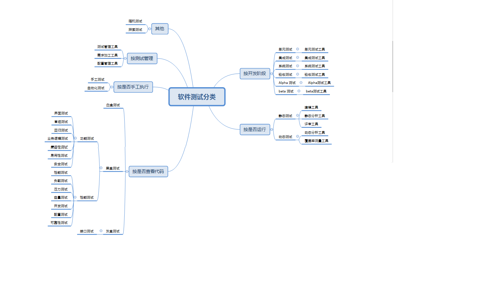

# 6工具支持的测试

**关键词**

数据驱动的测试(data-driven testing)， 关键字驱动的测试(keyword-driven testing)，
性能测试工具(performance testing tool)， 测试自动化(test automation)，
测试执行工具(test execution tool)， 测试管理工具(test management tool)

**测试工具的学习目标**

**6.1测试工具的考虑**

FL-6.1.1 (k2)根据其用途和支持的测试活动对测试工具进行分类

FL-6.1.2 (k1)确定测试自动化的收益和风险

FL-6.1.3 (k1)牢记测试执行工具和测试管理工具的特殊考虑

6.2 有效使用工具

FL-6.2.1 (k1)识别选择工具的主要原则

FL-6.2.2 (k1)回顾利用试点项目引进工具的目标

FL-6.2.3 (k1)确定组织中评估、实施、部署和持续支持测试工具的成功因素

## *6.1 测试工具的考虑*

### 6.1.1 测试工具分类

工具，顾名思义，是指工作时所需用的器具，后引申为达到、完成或促进某一事物的手段。工具是一个相对概念，因为其概念不是一个具体的物质，所以只要能使物质发生改变的物质，相对于那个能被它改变的物质而言就是工具。

百度百科上的解释（维基百科、谷歌）

以上，“权威”针对工具给出广袤而具体的解释。前面加上“测试”这个修饰语或者说是限定词，给缩小了工具的范围。应用于测试相关领域为达到、完成或促进某一事物的手段，即为测试工具，它是一个相对的概念，只要能完成或达到某一效果的“催化剂”或是手段都可以成为工具。

各种文章、测试相关书籍，以及
ISTQB初级、高级（测试管理、测试分析师、技术测试分析师）都含有关于测试工具的介绍。

认识到工具和技术之间的关系非常重要，技术是执行某个操作的过程，而工具是完成某个任务的方法。虽然软件测试技术有限，但是软件工具几乎是无限的。测试人员可以选择很多软件工具来完成指定的软件测试技术，就像木匠使用钉子、螺丝钉或粘合剂将两块木头固定在一起一样。可见，测试工具在测试执行、管理中的重要性。

引用《软件测试的有效方法》第三版，第四章第一节部分内容

那么测试工具究竟都有哪些，是怎么分类的呢？

工具可以按照多种规则进行分类，例如：目的、商业、免费/付费、开源、共享、使用的技术等。图6.1.1-1展示了软件测试工具的多样性。

图6.1.1-1 软件测试工具的类型

本文主要围绕测试工具所支持的测试活动来进行分类。一些工具提供的支持通常更适合开发人员（例如：在组件和集成测试期间使用的工具）。这些工具在以下各节中以"(D)"进行标识。

**测试和测试件管理的工具支持**

管理工具可适用于整个软件开发生命周期中的任何测试活动。支持测试和测试件管理的工具的例子包括：

-   测试管理工具和应用生命周期管理工具（ALM）

-   需求管理工具（例如：测试对象的可追溯性）

-   缺陷管理工具

-   配置管理工具

-   持续集成工具(D)

**静态测试的工具支持**

静态测试工具与第3章中描述的活动和收益相关联。这类工具的例子包括：

-   支持评审的工具

-   静态分析工具(D)

**测试设计与实现的工具支持**

测试设计工具有助于在测试设计和实现中创建可维护的工作产品，包括测试用例、测试规程和测试数据。这类工具的例子包括：

-   测试设计工具

-   基于模型的测试工具

-   测试数据准备工具

-   验收测试驱动开发（ATDD）和行为驱动开发（BDD）工具

-   测试驱动开发工具(TDD)（D）

在某些情况下，支持测试设计和实现的工具也可能支持测试执行和日志记录，或者将其输出直接提供给支持测试执行和日志记录的其他工具。

**测试执行与记录的工具支持**

有许多工具可以支持和增强测试执行和日志记录活动。这些工具的例子包括：

-   测试执行工具（例如：运行回归测试）

-   覆盖工具(例如：需求覆盖、代码覆盖(D))

-   测试用具(D)

-   单元测试框架工具(D)

**性能测量和动态分析的工具支持**

性能测量和动态分析工具对于支持性能和负载测试活动是必不可少的，因为这些活动不能有效地通过手工完成。这些工具的例子包括：

-   性能测试工具

-   监视工具

-   动态分析工具(D)

**特殊测试需要的工具支持**

除了支持一般测试过程的工具外，还有许多其他工具支持更具体的测试事件。其中包括侧重于以下方面的工具：

-   数据质量评估

-   数据转换和迁移

-   易用性测试

-   辅助性测试

-   本地化测试

-   安全性测试

-   可移植性测试（例如：在多个支持的平台上测试软件）

###  6.1.2 测试自动化的收益与风险

当代社会，付出都要有回报，高大上一点儿的说就是讲究一个投资回报率。那么在投入大量的人工、时间、金钱的情况下，自动化测试的收益如何呢？接下来从企业投入产出的角度来对自动化回归测试的财务投入和财务产出进行量化的分析，让大家能够对自动化回归测试所带来的好处有个更直观的认识和了解。

下面介绍一个自动化收益分析的例子。

https://www.cnblogs.com/shadowicool/articles/1061219.html

*该案例中的自动化回归测试与手工回归测试经济效益分析数据的选取，是基于两个标准：*

1.  *所有工作量的估算数据都来自于多名5年以上测试经验工程师的建议。*

2.  *所有工作量的估算方法，都是以基于对厂商有利的原则。如：有意减少目前手工回归测试的工作量，加大自动化测试开发的时间和成本。希望在此基础上算出的数据也能让未开展自动化测试的厂商直观的看到开展自动化测试上在财务上仍然有着非常高的投入产出回报比。*

*分析数据的取样标准如下：*

1.  *人力成本估算标准：厂商研发成本计算标准1.5万人月( RMB )， 一个月的工作日为
    22天。*

2.  *工作量估算标准：模块单元以完成一个DHCP（动态主机设置协议，Dynamic Host
    Configuration
    Protocol）大小模块的工作量为一个模块单元，即1个模块单元的手工回归测试时间为16个工作小时（不含性能测试）。*

3.  *自动化开发标准：一个自动化测试模块的开发时间为手工测试时间的4倍。假设一个模块可自动化测试部分的手工测试执行时间为8小时。那么该模块的自动化测试开发时间＝手工测试执行时间8小时＋脚本开发时间
    8小时＋脚本调试时间16小时。*

*假设一个小型产品线大致有72个模块单元需要进行回归测试。*

*如果都是手工执行，完成一轮较全面的回归测试的成本：需要投入[(72个模块单元×16小时)/8]/22=6.5人月，对应的人力成本为6.5×1.5万＝9.75万。*

-   *如果有2人专门从事手工回归测试，完成一次较全面的回归测试需要3.25个月，一年可执行约4次全面回归测试。*

-   *如果有3人专门从事手工回归测试，完成一次较全面的回归测试需要2.17个月，一年可执行约6次全面回归测试。*

-   *如果有4人专门从事手工回归测试，完成一次较全面的回归测试需要1.625个月，一年可执行7次全面回归测试。*

*假设一半的功能可以转化为自动化测试，从测试执行的人力投入上可以从6.5个人月减少到3.25个人月。那么每次全面回归测试需要投入费用也减少3.25×1.5=4.875万。*

*此时完成一次较全面的回归测试：*

-   *如果有2人专门从事剩余的手工回归测试，需要约1.6个月，一年执行约7次全面回归测试。较未自动化测试前可多测试3次，同时人均生产率提高了约75％。*

-   *如果有3人专门从事剩余的手工回归测试，需要1个月，一年执行12次全面回归测试。较未自动化测试前可多测试6次，同时人均生产率提高了约50％。*

-   *如果有4人专门从事剩余的手工回归测试，需要0.8个月，一年执行15次全面回归测试。较未自动化测试前可多测试8次，同时人均生产率提高了约110％。*

*自动化测试开发成本计算（每个单元只有一半转化为自动化）：*

>   *总开发时间=72个模块单元×8×4/2＝1152小时＝288天/22＝6.5人月*

>   *自动化测试开发成本=6.5×1.5万＝9.75万*

*自动化测试过后，每轮手工回归测试直接节省的成本为原全手工测试成本的一半即每轮回归测试可节省9.75/2=4.875万。*

*因此两轮较全面的回归测试就可以收回所有的自动化测试的开发成本。*

总的规律是：一年中进行的全面手工回归测试的次数越多，自动化测试的投入产出比越高。以目前某顶尖网络设备企业为例，它的自动化回归测试程度可以达到一周2轮全面回归测试来保证产品的质量，48小时完成一轮回归测试，72小时输出所有报表。从而大大解放了测试工程师的生产力，让其可以专注于新模块和新方法的测试，同时不用担心老模块的质量问题。

在阐述自动化测试的优劣势和风险之前，先来说下对自动化测试的理解上的一些误区；

-   是不是所有测试用例都可以自动化：不是所有的测试用例和测试步骤都可以转化为自动化测试。在自动化测试投入较多的行业领先企业其自动化测试率有的能达到80％左右，但仍有20％左右的测试用例需要手工来进行测试。在国外通常从开发第一版测试用例时，就同步进行自动化测试脚本的开发。

-   自动化测试找不到bug：自动化测试不直接找bug，而是通过解放有经验的测试工程师的生产力，让其从重复的回归测试中解放出来，从事新测试方法和测试手段的研究。通过自动化测试解放出的生产力来间接找到更多更深层次的新bug，将产品质量再提高一个档次。

-   自动化测试一定会马上大量减少测试人员数量：自动化测试不会大量减少测试人员数量。因为开展自动化测试初期需要投入一定的人力进行自动化测试脚本开发，并逐渐将自动化测试脚本用于日常的测试中，逐步减少手工测试人员从事重复劳动的时间和人数。为了缩短自动化测试脚本的开发时间，可考虑将自动化测试脚本的开发工作借助外包的力量来早日实现大规模的自动化测试。

-   自动化测试能代替手工测试：自动化测试不适合新功能测试，而是适合用于软件质量稳定且经常需要被测试的模块。

-   只有性能测试才需要自动化：自动化测试不光进行性能测试，更被大量应用于功能测试验证，超过半数的自动化测试脚本都是用于功能验证测试。

通常自动化回归测试较手工回归测试有如下优势：

1.  大大缩短回归测试项目的时间，在减少了人力投入的同时，更能保证研发项目能按时市场发布。甚至能缩短研发周期，提前发布产品。

2.  在同样的产品研发时间内，能对产品进行更全面的多次测试，将新引入的问题尽可能的在产品发布前挖掘出来。

3.  能保障回归测试的质量。因为每次自动化回归测试都是保持同一个标准的步骤、环境和测试方法。所以测试结果具有一致性。

4.  让更有经验的测试工程师从回归测试中解放出来，专注于新的测试方法的研究，来发现更多产品深层次的问题。

5.  减少测试工程师人数，降低研发成本。因为实施自动化回归测试后，厂商就不用像以前一样保留大量的人力来专职进行回归测试。

6.  能避免测试人力和时间的紧张，而降低了回归测试的质量要求，导致引入了新问题而未被发现。

7.  没有在手工回归测试中因为测试工作的重复性和测试工程师对已测过功能的过于自信，而导致测试覆盖面不全，新引入问题没被发现的人为隐患。

8.  避免了部分工程师非主观的疏忽大意，没有发现新引入的问题。

9.  对程序的回归测试更方便。这可能是自动化测试最主要的任务，特别是在程序修改比较频繁时，效果是非常明显的。由于回归测试的动作和用例是完全设计好的，测试期望的结果也是完全可以预料的，将回归测试自动运行，可以极大提高测试效率，可以极大提高测试效率，缩短回归测试时间。

10. 可以运行更多更繁琐的测试。自动化的一个明显的好处是可以在较少的时间内运行更多的测试。

11. 可以执行一些手工测试困难或不可能进行的测试。比如，对于模拟大量用户的测试，不可能同时让足够多的测试人员同时进行测试，但是却可以通过自动化测试模拟同时有许多用户，从而达到测试的目的。

12. 更好地利用资源，将繁琐的任务自动化，可以提高准确性和测试人员的积极性，将测试技术人员解脱出来投入更多精力设计更好的测试用例。有些测试不适合于自动化测试，仅适用于手工测试，将可自动测试的测试自动化后，可以让测试人员专注于手工测试部分，提高手工测试的效率。

13. 测试具有一致性和可重复性。由于测试是自动执行的，每次测试的结果和执行的内容的一致性是可以得到保障的，从而达到测试的可重复的效果。

14. 测试的复用性。由于自动化测试通常采用脚本技术，这样就有可能只需要做少量的甚至不做修改，实现在不同的测试过程中使用相同的用例。

15. 增加软件信任度。由于测试是自动执行的，所以不存在执行过程中的疏忽和错误，完全取决于测试的设计质量。一旦软件通过了强有力的自动测试后，软件的信任度自然会增加。

自动化测试的缺点：  

1.  不能取代手工测试，有很多需要人脑判断结果的测试用例无法用自动工具实现，或者代价太大；

2.  手工测试比自动化测试发现的缺陷更多； 

3.  对测试质量的依懒性极大；

4.  测试自动化不能提高有效性；

5.  测试自动化可能会制约软件开发，由于自动测试比手动测试更脆弱，所以维护会受到限制，从而制约软件的开发；

6.  工具本身并无想象力。

综上所述，自动化测试完成不了的，手工测试可以弥补，两者有效的结合是测试质量保证的关键。 

### 6.1.3 测试执行与测试管理工具的特殊考虑

采用什么样的自动化测试方案，需要考虑以下几个方面的因素：

-   项目的影响：自动化测试能否对项目的进度、覆盖率、风险有所帮助，或者让开发更敏捷？

-   复杂度：自动化是否容易实现，包括数据和其他环境的影响。

-   时间：自动化测试的实现需要多少时间？

-   早期需求和代码的稳定性：需求或早期的代码是否能证明是在范围内变化的？

-   维护工作量：代码是否能长期保持相对稳定？功能特性是否会进化？

-   覆盖率：自动化测试能否覆盖程序的关键特性和功能？

-   资源：测试组是否拥有足够的人力资源、硬件资源和数据资源来运行自动化测试。

-   自动化测试的执行：负责执行自动化测试的小组是否拥有足够的技能和时间去运行自动化测试？

采用不同的项目开发模型对自动化测试有不同的影响。

-   瀑布模型：瀑布模型在需求定义方面做得很好，这对自动化测试是有益的，包括可以尽早选择合适的自动化测试策略，让自动化测试可以从高层次、整体进行计划。

-   增量迭代模型：意味着频繁的变更，自动化测试需要与开发策略紧密结合，关注早期构建、迭代的速度、风险、覆盖目标等。

Bob Galen，Sizing up Automation Candidates – Selecting Which Tests，When To
Automate Them，and Which To Take Off the Ticket Entirely

为了顺利和成功地实现自动化测试，在选择和集成测试执行和测试管理工具到组织中时，有许多事情需要考虑。

**测试执行工具**

测试执行工具使用自动化测试脚本执行测试对象。这类工具往往需要付出巨大的工作量，才能取得显著的收益。

通过记录手动测试人员的动作来捕获测试似乎很有吸引力，但是这种方法无法应用到大量测试脚本的情况。捕获的脚本是作为每个脚本一部分的带有特定数据和动作的线性表示。当不可预料的事件发生时，这种类型的脚本是不稳定的。最新一代的工具利用了"智能"图像捕捉技术，增强了这类工具的效用，尽管生成的脚本仍然需要随着系统用户界面的发展不断进行维护。

数据驱动的测试方法将测试输入和预期结果分离出来，通常放入电子表格中，并使用更通用的测试脚本，通过读取输入数据并使用不同的数据执行相同的测试脚本。不熟悉脚本语言的测试人员可以为这些预先定义的脚本创建新的测试数据。

在关键字驱动的测试方法中，通用脚本处理描述要采取的动作的关键字（也称为动作词），然后调用关键字脚本处理相关的测试数据。测试人员（即使他们不熟悉脚本语言）可以使用关键字和相关数据定义测试，这些关键字和相关数据可以根据正在测试的应用程序进行裁剪。数据驱动和关键字驱动的测试方法的进一步细节和例子，可以参考ISTQB-TAE高级测试自动化工程师大纲。

上述方法需要有人具备脚本语言的专门知识（测试人员、开发人员或测试自动化方面的专家）。无论使用何种脚本技术，每个测试的预期结果都需要与测试的实际结果进行比较，或者是动态的（在测试运行时），或者是存储供以后（执行后）比较。

基于模型的测试（MBT）工具能够以模型的形式捕获功能规格说明，例如活动图。此任务通常由系统设计人员执行。MBT工具解释模型以创建测试用例规格说明，然后保存在测试管理工具中和/或通过测试执行工具执行（见ISTQB-MBT基础级别基于模型的测试大纲）。

**测试管理工具**

测试管理工具经常由于各种原因需要与其他工具或电子表格相互交互，包括：

-   以适合本组织要求的格式提供有用的信息

-   对需求管理工具中的需求保持一致的可追溯性

-   在配置管理工具中与测试对象版本信息链接

## *6.2有效使用工具*

### 6.2.1 工具选择的主要原则

>   **1、适用**

在选择工具的过程中，并不是说功能越多越好，适用才是根本，工具越适合于需完成的任务
，测试的过程就越有效。即主要考虑与测试对象进行交互的质量。主要考虑的因素包括：

-   能寻找测试对象的缺陷

-   节省测试时间

-   协助问题的诊断

-   能改进测试的机会

>   **2、工具引入的一致性**

了解测试对象使用的技术，选择与该技术兼容的工具。该工具是否适用于测试对象和开发环境？

要选择适合软件生命周期各阶段的测试工具。如：

-   基于嵌入式的测试可选择LDRA Testbed、GESTE、Logiscope等；

-   程序编码阶段可选择Tele2logic 公司的Logiscope 软件、Rational
    公司的Purify系列等;

-   测试和维护阶段可选择Compuware 的Dev2Partner 和Telelogic 的Logiscope 等。

>   **3、与现有开发环境的持续集成性**

考虑与已经使用的构建和其他工具持续集成的可能性。确保工具之间的兼容性和集成性。如果想避免自动化测试产生的延迟，团队最终会把工具放入持续集成的进程中。持续集成下的测试产生一个新的需求：测试需要对代码进行版本化。当创建新的代码分支时，我们会创建一个新的测试分支。这样，具有多个"正确"定义的多个持续集成管道可以同时运行。

>   **4、组织的能力**

主要从工具使用人员的技术能力、组织的资金、组织成熟度方面的优势、弱势等方面考虑。

-   考虑工具使用人员的技术能力，选择成熟度好、易于测试人员使用、方便上手、易于搭建的工具；

-   组织的资金，考虑购买成本、相关的培训、辅导费用。

>   **5、工具输出报告**

若测试工具没有对使用者输出有意义的东西，那它就是一项糟糕的投资。除非团队想要把测试结果推到另一个系统以获取更好的测试报告，否则输出的各种图表功能可能就没用。

随着时间的推移，跟踪测试也可能是一个非常强大的功能。不同层次的领导关心不同的结果。高水平的主管可能并不想知道成功失败比率的走向；中层管理人员希望了解工作流程；技术人员希望深入了解特定测试中出错的细节，如果可能的话，观看执行的视频。

>   **6、工具制造商的服务、可靠性、维护成本、价格以及使用期限**

如果长期使用，考虑成熟稳定的供应商提供的工具，供应商的支持人员能够正确解答各种疑难问题；如果短期使用，考虑开源的非商业工具的支持，此时注重完成测试的符合度。最重要的是工具带来的预期收益要大于购买和培训工具使用的费用。

### 6.2.2 组织内引入工具的试点项目

完成工具选择的理论分析后，要付诸实践，需要将该工具引入公司。为此要实施一个试点项目，以验证在实际的项目环境下是否确实能实现预期的优势和利益。试验项目不应该由参与评估的人员来进行，以防在解释评估结果时可能产生的利益冲突。

在工具的引入开始阶段，需要工具用户和相关人员大量且不断的投入，产生额外的工作量。因此在公司上下大范围内宣扬工具是不合适的，一般指导和培训有助于给将来的使用者带来信心。

运行试点项目，可以获取有关工具技术细节的信息、工具的实际使用经验、有关应用环境的经验，以及明确是否进行大范围的培训，培训到什么程度等问题。此外，还应该制定广泛使用工具的规范和规则。同时判定构建测试库是否合理，以便促进其他项目中的重要模块。

工具引入试点项目的成功因素有以下几点：

-   逐步引入。深入了解该工具，了解其优点和缺点

-   将工具集成到过程中，验证该工具在实际使用中与预期的符合度，并确定需要改变的地方

-   制定应用工具的规则并提供建议

-   接受培训和持续指导

-   收集使用经验并传授给所有用户相关的方法和技巧

-   监测工具的接受度并收集和评估成本效益数据。

一般的引入步骤：

1.  开展试点项目

2.  评估试点项目经验

3.  调整过程并制定使用规则

4.  接受培训

5.  逐步引入工具

6.  提供相应指导

### 6.2.3 使用工具的成功因素

如何让工具在组织内成功使用起来，使工具发挥其真正价值，给组织带来收益呢？正确的对工具进行评价、执行、部署以及持续支持等方面的工作。从以下几个方面考虑：

-   明确使用目标，并把目标细化，确保在技术和组织上能集成到组织的软件开发生命周期中，有助于工具使用的实施。

-   得到高层的支持，推广并使用起来，使参与者都积极参与进来。

-   使用过程中，调整、改进相关过程和规范，以适用工具的使用。

-   推广使用过程中，对工具进行培训和辅导。确保使用初期对工具能快速上手，快速掌握。使用过程中，遇到问题，及时辅导，消除使用过程中的障碍，提高使用信心。

-   在实际使用过程中，收集使用者的反馈信息。

-   对使用过程进行监视，对其收益随时进行预估和评价

-   收集使用经验和教训，整理，共享，使成为组织的过程资产。